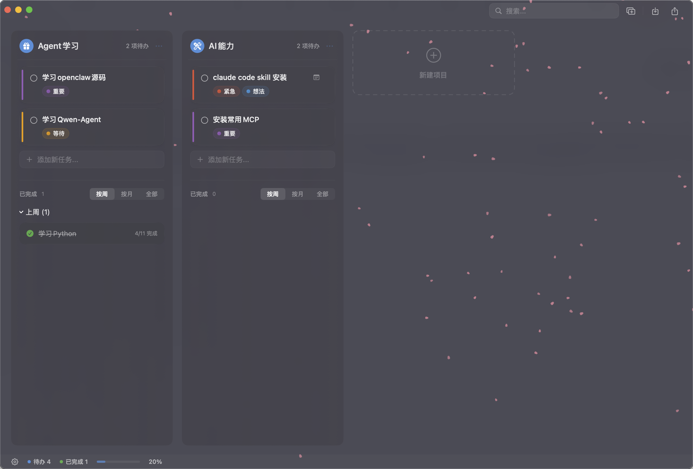

# TodoBoard

<p align="center">
  
</p>

<p align="center">
  <a href="https://github.com/xus2019/TodoBoard/releases/latest"></a>
  <a href="https://github.com/xus2019/TodoBoard/actions/workflows/ci.yml"></a>
  
  
  <a href="LICENSE"></a>
</p>

A native macOS kanban board app built with SwiftUI. Uses plain Markdown files as the single source of truth — your data is always human-readable and portable.

原生 macOS 看板 Todo 应用，以 Markdown 文件作为唯一数据源，数据随时可被任何文本编辑器直接读写。

---

## Features / 功能

- **Kanban board** with multiple project columns / 多列看板，每列对应一个项目
- **Markdown-based storage** — each project is a `.md` file / Markdown 文件存储，格式完全开放
- **Live file sync** — external edits reload instantly / 实时监听文件变化，外部编辑器修改后自动刷新
- **4 themes** (Moonlight / Daylight / Solarized / Minimal) / 4 套主题
- **Ambient effects** — rain, snow, fireflies, sakura, stardust / 氛围粒子效果（雨/雪/萤火虫/樱花/星尘）
- **Global shortcut** for quick input / 全局快捷键快速添加待办
- **Archive & grouping** by week / month / all / 归档区按周/月/全部分组
- **Tag system** with custom colors / 自定义标签与颜色
- **Drag & drop** reordering and cross-column move / 拖拽排序与跨列移动
- **Search overlay** / 全局搜索浮层
- **Import / Export** Markdown / 导入导出 Markdown

## Requirements / 系统要求

- macOS 14.0 (Sonoma) or later
- Apple Silicon or Intel Mac

## Installation / 安装

### Download (Recommended) / 直接下载（推荐）

1. Go to [Releases](https://github.com/xus2019/TodoBoard/releases/latest)
2. Download `TodoBoard.dmg`
3. Open the DMG, drag **TodoBoard.app** to your Applications folder
4. Open Terminal and run:
   ```bash
   xattr -cr /Applications/TodoBoard.app
   ```
5. Double-click to launch

> **为什么需要这一步？** TodoBoard 尚未经过 Apple 公证，macOS 会阻止直接打开。执行上面的命令可去除隔离标记，只需操作一次。

### Build from Source / 从源码构建

```bash
git clone https://github.com/xus2019/TodoBoard.git
cd TodoBoard
open Package.swift   # Opens in Xcode, run the macOS App target
```

Or via command line:

```bash
swift build -c release
```

## Data / 数据存储

All data is stored locally at `~/Documents/TodoBoard/`:

- Each project → one `.md` file (YAML front matter + GFM checkbox syntax)
- App config → `.todoboard.json`

No cloud sync, no account required. Your data is entirely yours.

所有数据本地存储于 `~/Documents/TodoBoard/`，无需账号，无网络依赖。

## Contributing / 贡献

Contributions are welcome! Please read [CONTRIBUTING.md](CONTRIBUTING.md) first.

欢迎贡献代码！请先阅读 [CONTRIBUTING.md](CONTRIBUTING.md)。

- [Report a bug](https://github.com/xus2019/TodoBoard/issues/new?template=bug_report.md)
- [Request a feature](https://github.com/xus2019/TodoBoard/issues/new?template=feature_request.md)

## License / 许可证

[MIT](LICENSE) © 2025 xus2019
